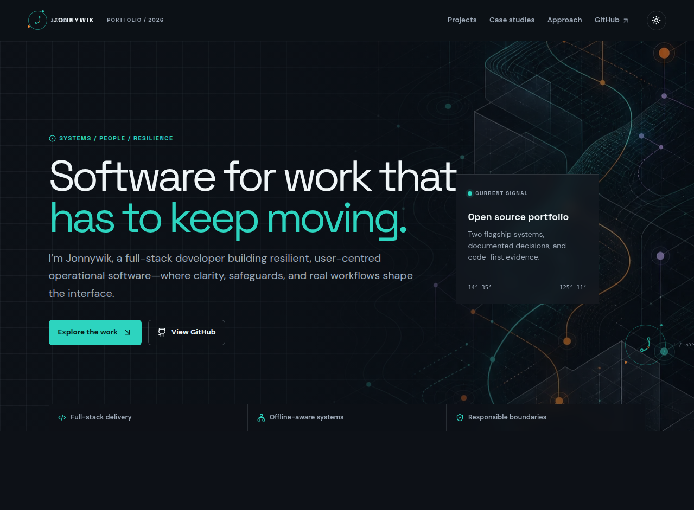

# Jonnywik — Portfolio Command Center

> **An interactive, source-first portfolio that turns real engineering work into a traceable project map.**

The Portfolio Command Center presents two flagship systems—**Code for Resilience** and **Employee Management Dashboard**—through real repository links, architectural context, documented boundaries, and accessible interaction. It is itself a third flagship project: the design and interaction layer connecting the portfolio’s evidence to its source.

**[GitHub profile](https://github.com/Jonnywik)** · **[Resilience Command Center](https://github.com/Jonnywik/EnvScie-CommandCenter)** · **[Employee Management Dashboard](https://github.com/Jonnywik/employee-management-dashboard)**

## Project signal

| System role | Source trace | Design focus |
| --- | --- | --- |
| Interactive engineering portfolio | `client/pages` → `components` → `index.css` → `ideas.md` | Evidence before decoration, operational taxonomy, accessible interaction, and an ownable route-node identity. |

## Interface reference



> **Authentic interface capture.** The portfolio contains no user accounts, customer data, personal-data collection, or external tracking. Its project claims link directly to the relevant public source repositories.

## Experience map

| Surface | Interaction | Purpose |
| --- | --- | --- |
| **Project explorer** | Filter fields and case-study selectors | Lets visitors trace the work by operational domain rather than scan a static card grid. |
| **Decision record** | Evidence panels and source maps | Connects design rationale to the code and documentation behind each project. |
| **Build principles** | Keyboard-accessible principle tabs and theme control | Explains the engineering values that shape the portfolio experience. |

## Design direction

The interface uses a dark technical editorial system: near-black ink surfaces, signal teal for primary interaction, warm orange for decisions, and a visual motif of route grids and connected system nodes. The experience is designed to be useful before it is decorative.

## Local development

```bash
pnpm install
pnpm dev
```

Quality checks and production build:

```bash
pnpm check
pnpm build
```

## Interaction and accessibility

The site includes project filters, case-study selection, a build-principles stepper, responsive navigation, and a light/dark theme control. It provides visible focus states and respects reduced-motion preferences. Every portfolio destination links to the relevant public GitHub source.

## Deployment

The included GitHub Actions workflow builds the static site and deploys the Pages artifact through a manually triggered release path once GitHub Pages is enabled for the repository. No database, authentication, personal-data collection, or external tracking is used.

## Featured sources

- [Code for Resilience — Command Center](https://github.com/Jonnywik/EnvScie-CommandCenter)
- [Employee Management Dashboard](https://github.com/Jonnywik/employee-management-dashboard)
- [Jonnywik GitHub profile](https://github.com/Jonnywik)
